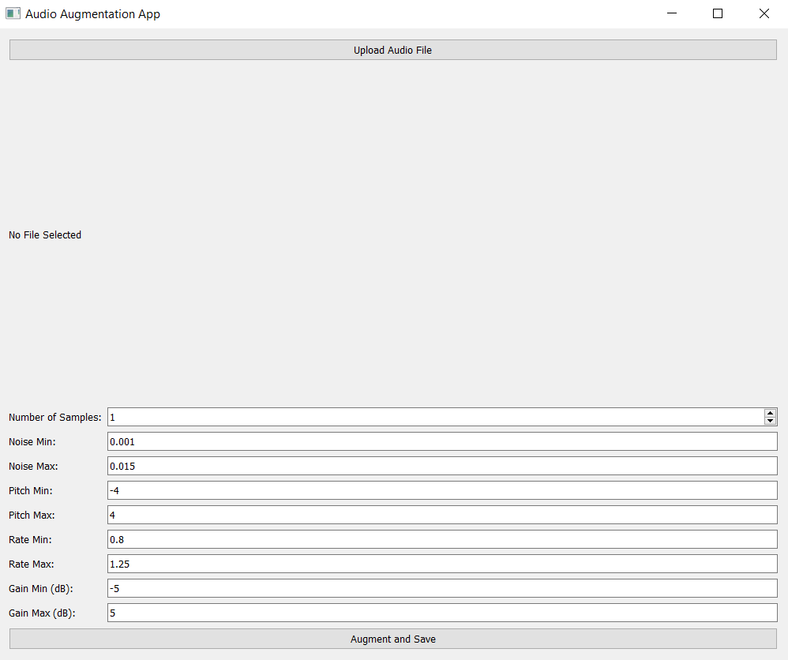

# PyAudioAugment Tool 🔊

## Introduction
The PyAudioAugment Tool is a powerful Python package tailored to augment audio files effortlessly, revolutionizing the enhancement of datasets for machine learning and data science endeavors focusing on audio processing. Leveraging the renowned `audiomentations` library, this tool offers a comprehensive suite of transformations, including noise addition, pitch shifting, time stretching, and gain adjustment, thereby amplifying the diversity and robustness of audio datasets.

### Here's how AugmentImg User Interface looks like

 

## Key Features
- **Noise Addition**: Introduce Gaussian noise into audio files to simulate real-world scenarios, enhancing the dataset's realism.
- **Pitch Shifting**: Modify the pitch of audio files while preserving their duration, enabling exploration of pitch-sensitive models.
- **Time Stretching**: Alter the speed and duration of audio files without impacting pitch, providing insights into temporal variations.
- **Gain Adjustment**: Adjust the volume of audio files to assess model sensitivity to volume fluctuations, enhancing model generalization.

## How It Works
The PyAudioAugment Tool empowers users to transform a limited audio dataset into a vast resource by generating augmented samples through various transformations. By applying diverse augmentations to existing audio files, users can create a rich dataset encompassing a wide range of audio variations. These augmented samples can then be converted into feature vectors, capturing essential audio characteristics, and utilized in a myriad of machine learning use cases, including:

1. **Speech Recognition**: Augmented audio samples enable training robust speech recognition models capable of handling various accents, background noise levels, and speaking rates.

2. **Sound Classification**: Diverse audio datasets facilitate the training of sound classification models capable of accurately identifying a wide range of sounds in different environments.

3. **Music Genre Classification**: Augmented audio samples covering diverse genres, tempos, and instrumentation aid in training music genre classification models with improved accuracy and generalization.

4. **Anomaly Detection**: By augmenting audio samples with various anomalies, models can be trained to detect and classify abnormal sounds in real-time audio streams, crucial for applications such as fault detection and security monitoring.

5. **Speaker Identification**: Augmented audio datasets containing variations in pitch, speed, and background noise enable training robust speaker identification models capable of recognizing speakers under diverse conditions.

## Getting Started
To begin using the PyAudioAugment Tool, follow these simple steps:

 **Installation**: Install the package using pip:

    
    pip install pyaudioaugment

  **Once the library is installed run the following:**
    
    audio-augment
    

**Usage**: Import the package and use the provided functions to augment your audio files programmatically, or run the GUI interface to interactively augment audio files.

**Integration**: Integrate the augmented audio dataset into your machine learning pipeline by extracting feature vectors using libraries like Librosa and training your models using frameworks like TensorFlow or PyTorch.

## Contribution Guidelines
We welcome contributions to enhance the PyAudioAugment Tool! Feel free to fork the repository, make your modifications, and submit a pull request. Contributions could include adding new augmentations, improving documentation, or enhancing the GUI interface.

## License
This project is licensed under the MIT License. See the [LICENSE](LICENSE) file for details.

## Acknowledgments
The PyAudioAugment Tool relies on the audiomentations library for PyAudioAugment capabilities. We extend our gratitude to the audiomentations, Librosa, and PyQt5 communities for their invaluable contributions to the field of audio processing and GUI development.
